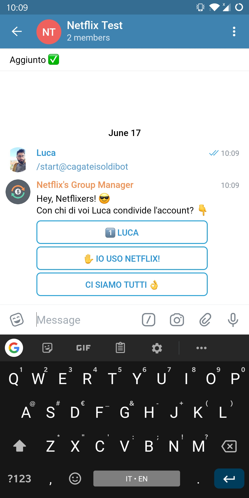
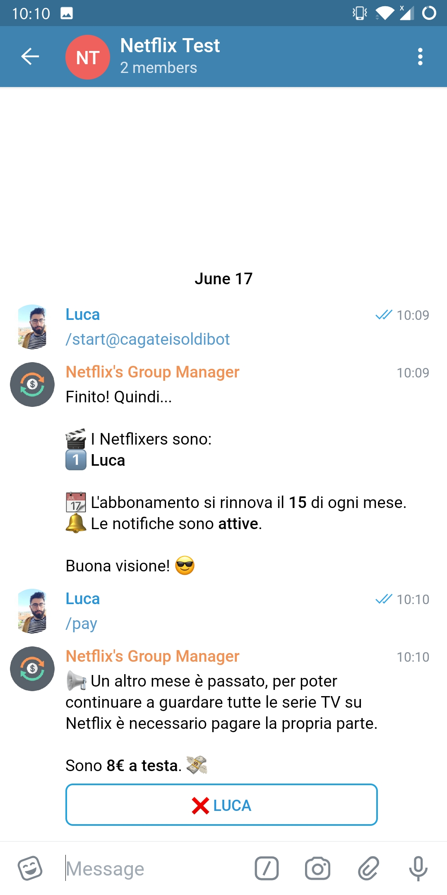

# 💰 CagateiSoldiBot &middot; [](https://github.com/xLinkOut/cagateisoldibot/master/LICENSE)
CagateiSoldi is a Telegram bot to manage Netflix's shared account with your friends and family. In english _'cagate i soldi'_ is something like _'give me your money'_.

+ **Easy:** Add the bot to your Netflix's Telegram group, let your friends join the bot's list, set the day the subscription is renewed and you're done.
+ **Reminders:** Every month, on the day your Netflix subscription is renewed, the bot send a notification in your group with the list of people who have to give you money. They could mark themselves as payed, but you, the admin, have to confirm the payment.
+ **Free and Open source:** I really believe in an open source world.

Configuration | Reminder
:------------:|:--------:
 | 

## [Installation:](https://asciinema.org/a/215057)
```bash
    $ virtualenv -p python3 venv # optional
    $ source venv/bin/activate # optional
    $ pip3 install -r requirements.txt
    # Obviously replace YOUR_TOKEN with bot's token given by BotFather.
    $ sed 's/INSERT_TOKEN_HERE/YOUR_TOKEN/' -i src/Settings.py
    $ python3 CreateDB.py
    $ python3 Main.py
```

## Todo
- [x] Notify a member when his payment is confimed by the admin;
- [ ] Notify the admin if the bot is removed from a group;
- [ ] Send a bunch of other messages if someone's money is missing;
- [ ] Add screenshots to this readme;

## Try it here!
It's still in beta and can stop working/losing data without warning, but you can give a try: [http://t.me/cagateisoldibot](http://t.me/cagateisoldibot) 
